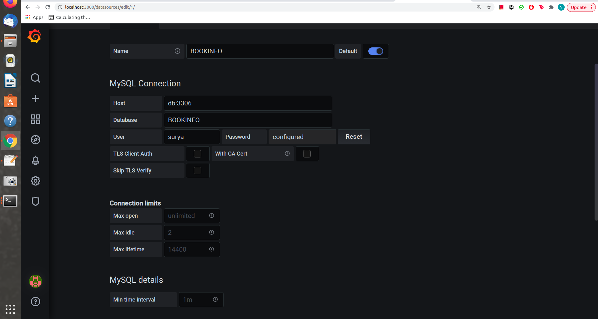
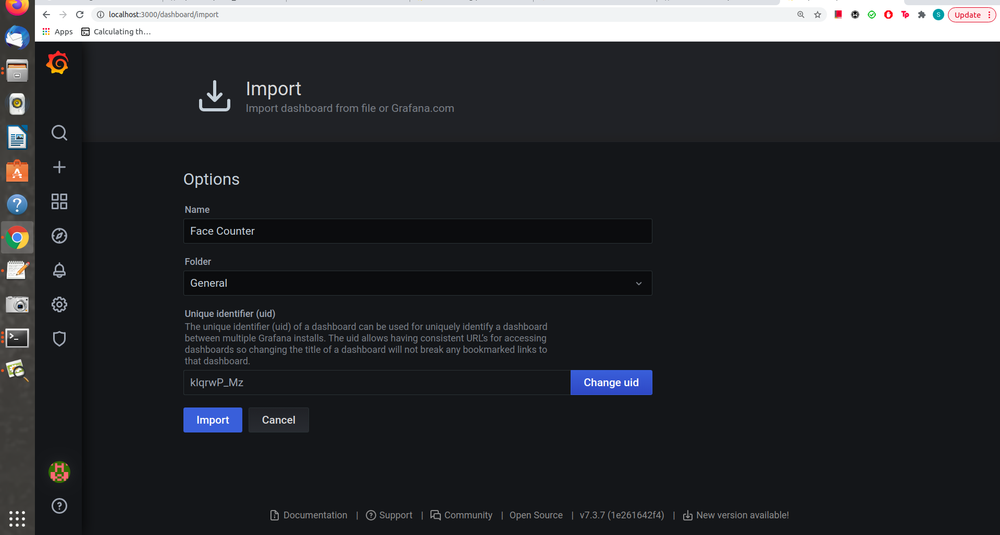

# Face Counter


OS: Ubuntu:18.04


## Introduction

This application count the number of faces in each frames and displays the total count of faces along with the video stream on grafana dashboard

## How it Works
- The application uses haar cascade face detection model to detect faces and take input from camera. It updates the count of faces for each frame to MySQL database and the final visualization can be seen on Grafana dashboard

## Setup
### Get the code
Clone the reference implementation
```
sudo apt-get update && sudo apt-get install git
git clone https://github.com/spsc0894/face_counter
```


## Run the application

Change the current directory to the git-cloned application code location on your system:
```
cd face_counter
```
Execute below command:
    ```
    sudo make my-app
    ```

Once all the containers are created check logs for grafana and mysql containers on seperate terminal wondows to make sure they are ready to take connections

    ```
    docker logs -f docker_grafana_1
    ```

    ```
    docker logs -f docker_db_1
    ```

Verify that grafana and mysql container are ready to take connections as shown in below screenshots


#Once both grafana and mysql are ready to take connection. Go to: http://localhost:3000


Login using below credentials:
    ```
    Username: admin
    password: admin
    ```

#Add datasource

Click on Datasources as shown in below screenshot:


Click on "Add Datasource" and select "MySQL"


Provide the details as shown in below screenshot:

Name: BOOKINFO

HOST: db:3306

Database: BOOKINFO

User: surya

password: admin




And click on "Save and test"

##Add Dashboard

In the left panel click on "+" symbol and select import


Select Upload JSON and browse to face_counter/grafana/dashboard and upload dashboard.json



Now you can see the video stream and the count of faces alongside


